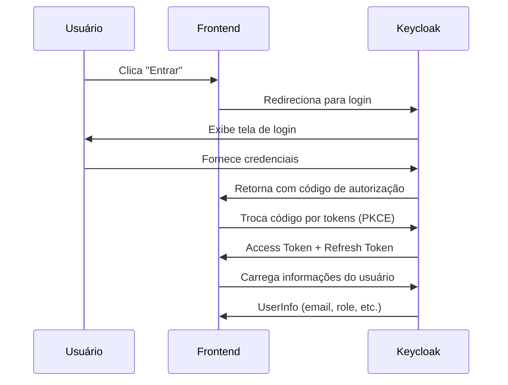

# Autenticação com Keycloak - PROAE Frontend

## Arquitetura

### Fluxo de Autenticação



### Componentes Principais

#### 1. **AuthProvider** (`src/providers/AuthProvider.tsx`)

- Gerencia estado global de autenticação
- Integra com `@react-keycloak/web`
- Carrega informações do usuário automaticamente
- Valida tokens e gerencia expiração

#### 2. **AuthContext** (`src/context/AuthContext.ts`)

- Context API para compartilhar estado de auth
- Fornece hooks typados e seguros

#### 3. **ProtectedRoutes** (`src/Auth/`)

- `ProtectedRouteAluno`: Rotas exclusivas para alunos
- `ProtectedRouteProae`: Rotas exclusivas para PROAE
- Validação automática de role e token

## Configuração

### Variáveis de Ambiente (.env)

```bash
VITE_KEYCLOAK_SERVICE_URL=http://localhost:8080/
VITE_KEYCLOAK_REALM=proae-realm
VITE_KEYCLOAK_CLIENT_ID=proae-frontend
```

### Configuração do Keycloak (`src/keycloak.ts`)

```typescript
import Keycloak from 'keycloak-js';

const keycloak = new Keycloak({
  url: import.meta.env.VITE_KEYCLOAK_SERVICE_URL,
  realm: import.meta.env.VITE_KEYCLOAK_REALM,
  clientId: import.meta.env.VITE_KEYCLOAK_CLIENT_ID,
});

export default keycloak;
```

### Inicialização (`src/main.tsx`)

```typescript
<ReactKeycloakProvider
  authClient={keycloak}
  initOptions={{onload: 'check-sso'}}
  LoadingComponent={<div>Loading...</div>}
>
  <AuthProvider>
    <RouterProvider router={router} />
  </AuthProvider>
</ReactKeycloakProvider>
```

## Funcionalidades Implementadas

### Autenticação

- **Login**: Redirecionamento automático para Keycloak
- **Logout**: Invalidação de sessão completa
- **Auto-check**: Verificação automática de sessão existente

### Autorização

- **Roles**: Diferenciação entre 'aluno' e 'proae'
- **Rotas Protegidas**: Acesso baseado em role
- **Validação**: Verificação contínua de token válido

### Gerenciamento de Estado

- **Context API**: Estado global acessível
- **Token Management**: Automático via Keycloak
- **User Info**: Carregamento automático após login

### Proteção de Rotas

```typescript
// Rotas protegidas para alunos
{
  element: <ProtectedRouteAluno />,
  children: [
    { path: "portal-aluno", element: <PortalAluno /> },
    // ... outras rotas de aluno
  ],Contexto

Estamos substituindo o Clerk como provedor de autenticação e adotando o Keycloak para centralizar a autenticação e autorização via OAuth2. O Front-End deverá integrar com o Keycloak utilizando o fluxo Authorization Code Flow com PKCE, removendo toda dependência do Clerk.

O objetivo é que as rotas de Login, Cadastro e Recuperação de Senha sejam redirecionadas para o Keycloak, e o Front-End trate a autenticação baseada nos tokens (Access Token, Refresh Token) fornecidos pelo Keycloak.

Objetivo

Remover Clerk completamente do projeto Front-End.

Implementar o fluxo de autenticação via Keycloak (Authorization Code Flow + PKCE).

Gerenciar o estado de autenticação (tokens) no Front-End.

Proteger rotas privadas de forma adequada.

Ajustar links e componentes relacionados ao fluxo de autenticação para Keycloak.

Critérios de Aceitação

Clerk removido do projeto (package.json e código).

Implementado redirecionamento para o login do Keycloak.

Após login, tokens devem ser recebidos e armazenados de forma segura (preferencialmente via Cookie HttpOnly, caso a API esteja configurada para isso, ou no Front-End via Context).

Criar Context/Hook useAuth para gerenciar estado de autenticação e tokens.

Rotas privadas devem validar a existência e validade do Access Token.

Implementar logout redirecionando para o endpoint de logout do Keycloak.

Botões e links de Login/Cadastro/Esqueci a Senha devem apontar para as URLs corretas do Keycloak.

Documentar o novo fluxo de autenticação no Front-End.

Requisitos Técnicos

Utilizar Authorization Code Flow com PKCE (seguro para SPAs).

Utilizar a biblioteca oficial keycloak-js ou implementar o fluxo manualmente (dependendo da stack).

Configurar um "AuthProvider" no Context API para:

Iniciar Keycloak.

Fornecer os dados do usuário autenticado (user info).

Gerenciar tokens e auto-refresh.

Proteger rotas privadas com validação de token (HOC ou Middleware).

Redirecionar o usuário para login no Keycloak quando não autenticado.

Logout deve invalidar sessão no Keycloak e limpar tokens do Front-End.

Notas

Keycloak Realm: [link ou nome do realm]

Documentação Keycloak OAuth2: https://www.keycloak.org/docs/latest/securing_apps/#_javascript_adapter

Endpoints disponíveis:

Login: /realms/{realm-name}/protocol/openid-connect/auth

Token: /realms/{realm-name}/protocol/openid-connect/token

Logout: /realms/{realm-name}/protocol/openid-connect/logout

O Back-End gerenciará a renovação automática de tokens (Refresh Token Rotation).

Precisamos tratar cenários de Multi-Tenant no fluxo de login.

Contexto

Estamos substituindo o Clerk como provedor de autenticação e adotando o Keycloak para centralizar a autenticação e autorização via OAuth2. O Front-End deverá integrar com o Keycloak utilizando o fluxo Authorization Code Flow com PKCE, removendo toda dependência do Clerk.

O objetivo é que as rotas de Login, Cadastro e Recuperação de Senha sejam redirecionadas para o Keycloak, e o Front-End trate a autenticação baseada nos tokens (Access Token, Refresh Token) fornecidos pelo Keycloak.

Objetivo

Remover Clerk completamente do projeto Front-End.

Implementar o fluxo de autenticação via Keycloak (Authorization Code Flow + PKCE).

Gerenciar o estado de autenticação (tokens) no Front-End.

Proteger rotas privadas de forma adequada.

Ajustar links e componentes relacionados ao fluxo de autenticação para Keycloak.

Critérios de Aceitação

Clerk removido do projeto (package.json e código).

Implementado redirecionamento para o login do Keycloak.

Após login, tokens devem ser recebidos e armazenados de forma segura (preferencialmente via Cookie HttpOnly, caso a API esteja configurada para isso, ou no Front-End via Context).

Criar Context/Hook useAuth para gerenciar estado de autenticação e tokens.

Rotas privadas devem validar a existência e validade do Access Token.

Implementar logout redirecionando para o endpoint de logout do Keycloak.

Botões e links de Login/Cadastro/Esqueci a Senha devem apontar para as URLs corretas do Keycloak.

Documentar o novo fluxo de autenticação no Front-End.

Requisitos Técnicos

Utilizar Authorization Code Flow com PKCE (seguro para SPAs).

Utilizar a biblioteca oficial keycloak-js ou implementar o fluxo manualmente (dependendo da stack).

Configurar um "AuthProvider" no Context API para:

Iniciar Keycloak.

Fornecer os dados do usuário autenticado (user info).

Gerenciar tokens e auto-refresh.

Proteger rotas privadas com validação de token (HOC ou Middleware).

Redirecionar o usuário para login no Keycloak quando não autenticado.

Logout deve invalidar sessão no Keycloak e limpar tokens do Front-End.

Notas

Keycloak Realm: [link ou nome do realm]

Documentação Keycloak OAuth2: https://www.keycloak.org/docs/latest/securing_apps/#_javascript_adapter

Endpoints disponíveis:

Login: /realms/{realm-name}/protocol/openid-connect/auth

Token: /realms/{realm-name}/protocol/openid-connect/token

Logout: /realms/{realm-name}/protocol/openid-connect/logout

O Back-End gerenciará a renovação automática de tokens (Refresh Token Rotation).

Precisamos tratar cenários de Multi-Tenant no fluxo de login.
}

// Rotas protegidas para PROAE
{
  element: <ProtectedRouteProae />,
  children: [
    { path: "portal-proae/inscricoes", element: <InscricoesProae /> },
    // ... outras rotas de PROAE
  ],
}
```

## Segurança

### PKCE (Proof Key for Code Exchange)

- **Automático**: Implementado pelo `keycloak-js`
- **Seguro**: Previne ataques de interceptação de código
- **Padrão**: Recomendado para SPAs

### Validação de Tokens

- **Automática**: Verificação contínua de expiração
- **Logout automático**: Em caso de token inválido
- **Renovação**: Gerenciada pelo Keycloak

### Controle de Acesso

- **Role-based**: Acesso baseado no papel do usuário
- **Token validation**: Verificação de autenticação
- **Redirecionamento**: Para home se não autorizado

## Configuração do Cliente Keycloak

### Configurações Obrigatórias

#### **Client Settings:**

- **Client Type**: `Public` (para SPAs)
- **Valid Redirect URIs**: `http://localhost:5173/*`
- **Valid Post Logout Redirect URIs**: `http://localhost:5173`
- **Web Origins**: `http://localhost:5173`

## Estrutura de Dados do Usuário

```typescript
interface UserInfo {
  username: string;           // preferred_username do Keycloak
  email: string;             // Email do usuário
  role: "aluno" | "proae";   // Role baseada no username
  sub?: string;              // ID único do usuário
  name?: string;             // Nome completo
  given_name?: string;       // Primeiro nome
  family_name?: string;      // Sobrenome
  email_verified?: boolean;  // Status de verificação do email
}
```
