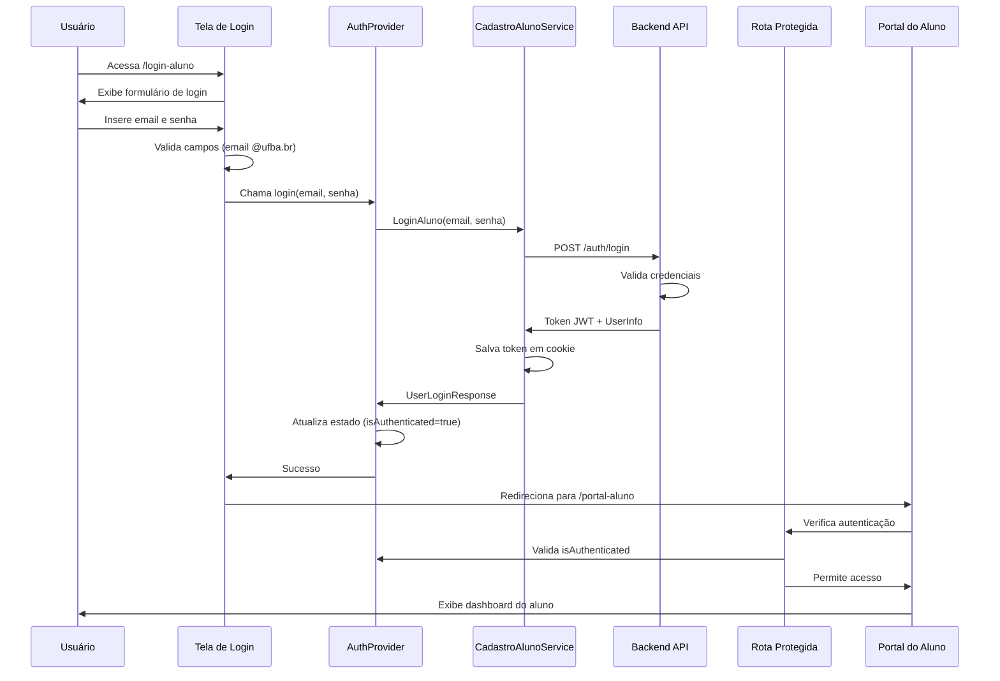

# Fluxo de Login do Usuário - PROAE Frontend

## Visão Geral

Este documento detalha o fluxo completo de autenticação de usuários (alunos) no frontend da aplicação PROAE, incluindo login, validação de sessão, proteção de rotas e logout.

## Arquitetura de Autenticação

### Diagrama de Fluxo



## Componentes Principais

### 1. **Tela de Login** (`src/pages/paginaAluno/LoginAluno/LoginAluno.tsx`)

**Responsabilidades:**
- Interface de login com validação em tempo real
- Captura de credenciais (email @ufba.br e senha)
- Feedback visual para estados de loading/erro
- Redirecionamento após login bem-sucedido

**Validações Implementadas:**
```typescript
// Validação de email obrigatório e domínio @ufba.br
if (!email) {
  setErroEmail("Email é obrigatório");
} else if (!email.includes("@ufba.br")) {
  setErroEmail("Email deve ser do domínio @ufba.br");
}

// Validação de senha obrigatória
if (!senha) {
  setErroSenha("Digite sua senha");
}
```

**Funcionalidades:**
-  Campo de email com validação @ufba.br
-  Campo de senha com toggle show/hide
-  Estado de loading durante autenticação
-  Link para cadastro

### 2. **AuthProvider** (`src/providers/AuthProvider.tsx`)

**Responsabilidades:**
- Gerenciamento global do estado de autenticação
- Integração com serviços de API
- Validação automática de tokens
- Controle de sessão

**Estado Gerenciado:**
```typescript
interface AuthState {
  isAuthenticated: boolean;    // Status de autenticação
  userInfo: UserInfo | null;   // Informações do usuário logado
  loading: boolean;            // Estado de carregamento
}
```

**Métodos Principais:**
```typescript
// Login do usuário
const login = async (data: UserLogin) => {
  const response = await cadastroAlunoService.LoginAluno(data);
  setUserInfo(response.user);
  setIsAuthenticated(true);
  return response;
};

// Logout do usuário
const logout = () => {
  cadastroAlunoService.LogoutAluno(); // Remove cookie
  setIsAuthenticated(false);
  setUserInfo(null);
};

// Validação automática de token
useEffect(() => {
  const checkAuth = async () => {
    const response = await cadastroAlunoService.validateToken();
    setUserInfo(response.user);
    setIsAuthenticated(true);
  };
}, []);
```

### 3. **CadastroAlunoService** (`src/services/CadastroAluno.service/cadastroAluno.service.ts`)

**Responsabilidades:**
- Comunicação com APIs de autenticação
- Gerenciamento de tokens JWT
- Manipulação de cookies

**Métodos de Autenticação:**
```typescript
class CadastroAlunoService {
  // Login do aluno
  async LoginAluno(data: UserLogin): Promise<UserLoginResponse> {
    const response = await this.httpClient.post('/auth/login', data);

    // Extrai e salva token do cookie de resposta
    const token = extractCookieFromHeaders(response.headers, 'token');
    if (token) {
      setCookie('token', token, 7); // 7 dias de expiração
    }

    return response.data;
  }

  // Validação de token existente
  async validateToken() {
    return await this.httpClient.post('/auth/validate-token', {});
  }

  // Logout - remove cookie
  async LogoutAluno() {
    deleteCookie('token');
  }
}
```

### 4. **Rotas Protegidas** (`src/Auth/ProtectedRouteAluno.tsx`)

**Responsabilidades:**
- Validação de acesso a rotas privadas
- Redirecionamento para login quando não autenticado
- Loading screen durante verificação

```typescript
export default function ProtectedRouteAluno() {
  const { isAuthenticated, loading } = useContext(AuthContext);

  if (loading) {
    return <LoadingScreen/>;
  }

  if (!isAuthenticated) {
    return <Navigate to="/login-aluno" replace />;
  }

  return <ProtectedAluno />;
}
```

## Fluxo Detalhado de Login

### 1. **Acesso à Tela de Login**
```typescript
// URL: /login-aluno
// Se já autenticado, redireciona para /portal-aluno
useEffect(() => {
  if (isAuthenticated) {
    navigate("/portal-aluno");
  }
}, [isAuthenticated]);
```

### 2. **Preenchimento e Validação**
```typescript
// Validação em tempo real
const handleEmailChange = (e) => {
  setEmail(e.target.value);
  setErroEmail(""); // Limpa erro ao digitar
};

// Validação no submit
const handleSubmit = async (e) => {
  e.preventDefault();

  // Validações obrigatórias
  if (!email || !email.includes("@ufba.br")) {
    setErroEmail("Email deve ser do domínio @ufba.br");
    return;
  }

  if (!senha) {
    setErroSenha("Digite sua senha");
    return;
  }

  // Prossegue com login...
};
```

### 3. **Processamento do Login**
```typescript
// No handleSubmit da tela de login
try {
  setIsLoading(true);
  await login({ email, senha });
  toast.success("Login realizado com sucesso!");
  navigate("/portal-aluno");
} catch (err) {
  toast.error("Erro ao realizar login. Verifique suas credenciais.");
} finally {
  setIsLoading(false);
}
```

### 4. **Comunicação com Backend**
```typescript
// Endpoint: POST /auth/login
// Request Body: { email: "aluno@ufba.br", senha: "senha123" }
// Response:
{
  "success": true,
  "user": {
    "aluno_id": 123,
    "nome": "João Silva",
    "email": "joao@ufba.br",
    "matricula": "202301234"
  }
}
// Cookie: token=eyJhbGciOiJIUzI1NiIs...
```

### 5. **Atualização do Estado Global**
```typescript
// No AuthProvider após login bem-sucedido
const fillUserInfo: UserInfo = {
  email: response.user.email,
  id: response.user.aluno_id,
  nome: response.user.nome
};
setUserInfo(fillUserInfo);
setIsAuthenticated(true);
```

### 6. **Redirecionamento e Acesso**
```typescript
// Navegação para portal protegido
navigate("/portal-aluno");

// ProtectedRouteAluno verifica autenticação
if (!isAuthenticated) {
  return <Navigate to="/login-aluno" replace />;
}

// Acesso liberado - renderiza portal
return <ProtectedAluno />;
```

## Validação Automática de Sessão

### Verificação na Inicialização
```typescript
// No AuthProvider - useEffect de inicialização
useEffect(() => {
  const publicRoutes = ['/login-aluno', '/cadastro-aluno', '/login-proae'];

  if (publicRoutes.includes(location.pathname)) {
    // Rotas públicas - não valida sessão
    setIsAuthenticated(false);
    setLoading(false);
    return;
  }

  // Rotas privadas - valida token existente
  const checkAuth = async () => {
    try {
      const response = await cadastroAlunoService.validateToken();
      setUserInfo(response.user);
      setIsAuthenticated(true);
    } catch (error) {
      // Token inválido/expirado - força logout
      setIsAuthenticated(false);
      cadastroAlunoService.LogoutAluno();
    } finally {
      setLoading(false);
    }
  };

  checkAuth();
}, [location.pathname]);
```

## Tratamento de Erros

### Erros de Validação de Formulário
```typescript
// Email inválido
if (!email.includes("@ufba.br")) {
  setErroEmail("Email deve ser do domínio @ufba.br");
}

// Campos obrigatórios
if (!senha) {
  setErroSenha("Digite sua senha");
}
```

### Erros de Autenticação
```typescript
// Credenciais inválidas
catch (err) {
  if (err?.message) {
    toast.error(err.message);
  } else {
    toast.error("Erro ao realizar login. Verifique suas credenciais.");
  }
}
```

### Erros de Token/Sessão
```typescript
// Token expirado ou inválido
catch (error) {
  setIsAuthenticated(false);
  setUserInfo(null);
  cadastroAlunoService.LogoutAluno();
  // Usuário é redirecionado para login automaticamente
}
```

## Fluxo de Logout

### 1. **Iniciação do Logout**
```typescript
// Usuário clica no botão de logout (sidebar)
const { logout } = useContext(AuthContext);
onClick={logout}
```

### 2. **Processamento do Logout**
```typescript
// No AuthProvider
const logout = useCallback(() => {
  cadastroAlunoService.LogoutAluno(); // Remove cookie
  setIsAuthenticated(false);         // Atualiza estado
  setUserInfo(null);                // Limpa dados do usuário
}, []);
```

### 3. **Limpeza e Redirecionamento**
```typescript
// Cookie removido automaticamente
deleteCookie('token');

// ProtectedRoute detecta mudança e redireciona
if (!isAuthenticated) {
  return <Navigate to="/login-aluno" replace />;
}
```

## Integração com Backend

### Endpoints Utilizados
```typescript
// Login
POST /auth/login
Body: { email: string, senha: string }
Response: { success: boolean, user: UserInfo }
Cookie: token (JWT)

// Validação de token
POST /auth/validate-token
Headers: Cookie: token
Response: { valid: boolean, user: UserInfo }

// Não há endpoint de logout - apenas remoção local do cookie
```

### Estrutura de Dados
```typescript
// UserLogin (request)
interface UserLogin {
  email: string;    // aluno@ufba.br
  senha: string;    // senha do usuário
}

// UserLoginResponse (response)
interface UserLoginResponse {
  success: string;
  user: {
    aluno_id: number;
    nome: string;
    email: string;
    matricula: string;
  };
}

// UserInfo (estado)
interface UserInfo {
  id: number;       // aluno_id
  nome: string;     // nome completo
  email: string;    // email @ufba.br
}
```
